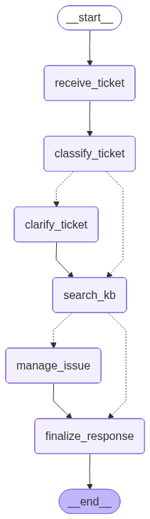

# Support Bot MVP

Прототип корпоративного бота техподдержки на `LangGraph`.

## Проект предоставляет упрощенную среду для:

- **Экспериментирования**: быстрая проверка новых сценариев маршрутизации обращений без лишней инфраструктуры
- **Промпт-инженерии**: настройка классификатора и LLM-проверки дублей
- **Тестирования поиска и дедупликации**: сравнение эвристик и текстовых similarity-алгоритмов
- **Быстрого прототипирования**: проверка новых идей до переноса в более крупную систему

Инфраструктура проекта остается компактной: один CLI-entrypoint, файловая база знаний, файловый реестр инцидентов, Docker-режим для локальной Ollama и отдельный режим для OpenRouter.

## Визуализация графа


## Как запускать

### Предварительная настройка

1. Перейти в папку `project`
2. Скопировать шаблон окружения:

```bash
cp .env.example .env
```

3. Убедиться, что в `.env` используются одинаковые относительные пути и для локального запуска, и для Docker:

```env
SUPPORT_BOT_KB_DIR=./kb
SUPPORT_BOT_ISSUES_PATH=./issues.json
SUPPORT_BOT_TAXONOMY_PATH=./data/taxonomy.json
```

### Способ 1. Запуск с локальной Ollama

Если бот должен работать через локальную модель `llama3.2:1b`, в `.env` нужно оставить пустой `OPENROUTER_API_KEY` и указать настройки Ollama:

```env
OPENROUTER_API_KEY=
OLLAMA_BASE_URL=http://localhost:11434
OLLAMA_MODEL=llama3.2:1b
SUPPORT_BOT_CLASSIFIER_MODEL=llama3.2:1b
SUPPORT_BOT_DEDUP_MODEL=llama3.2:1b
```

Варианты запуска:

- **Через Docker Compose**:

```bash
make run
```

или явно:

```bash
make run-ollama
```

- **Локально через Python**, если Ollama уже поднята на хосте:

```bash
make install
make run-local
```

### Способ 2. Запуск через OpenRouter

Если бот должен работать через OpenRouter, в `.env` нужно заполнить ключ и выбрать модель:

```env
OPENROUTER_API_KEY=your_openrouter_api_key
OPENROUTER_MODEL=openai/gpt-4o-mini
SUPPORT_BOT_CLASSIFIER_MODEL=openai/gpt-4o-mini
SUPPORT_BOT_DEDUP_MODEL=openai/gpt-4o-mini
```

В этом режиме Ollama не запускается. Команда:

```bash
make run
```

или явно:

```bash
make run-openrouter
```

## Структура проекта

### Entrypoint (`support_bot.py`)

- **Точка входа CLI-приложения**
- **Сборка графа, бесконечный цикл ввода проблем и запуск workflow**

### Конфигурация и фабрика LLM (`config/`)

- **Выбор источника LLM: OpenRouter, OpenAI или Ollama**
- **Подготовка клиента модели под текущий runtime-режим**

### Контракт состояния (`ticket_state.py`)

- **TypedDict-состояние тикета**
- идентификаторы тикета и пользователя
- список `messages`
- результаты KB-поиска
- финальный ответ
- трассировка через `history`

### Модели данных (`models.py`)

- **Pydantic-модели классификации, результатов поиска, задач и ошибок сервисов**

### Слой репозиториев (`repo/`)

- **Абстракции и файловые реализации**
- реестр инцидентов `issues.json`
- файловая база знаний `kb/`
- taxonomy из `data/taxonomy.json`

### Слой бизнес-логики (`service/`)

- **Классификация обращения**
- **Поиск по базе знаний**
- **Обработка дублей и создание новых задач**
- **Текстовые утилиты и similarity-алгоритмы**

### Тесты (`tests/`)

- **Проверка генерации search query**
- **Benchmark дублей на большом наборе текстов**

### Документация (`docs/`)

- **Визуализация графа workflow**

## Стек технологий

- Python 3.12
- LangGraph
- LangChain
- LangChain OpenAI
- LangChain Ollama
- Pydantic
- Docker
- Docker Compose
- Ollama

## Что умеет бот

- принимает обращение пользователя в CLI
- классифицирует обращение через LLM
- задает уточняющие вопросы, если данных недостаточно
- ищет решение по локальной базе знаний
- пытается найти дубликат в `issues.json`
- увеличивает `frequency` у уже известной проблемы
- создает новую задачу, если дубль не найден

## Команды Makefile

```bash
make install
make run
make run-openrouter
make run-ollama
make run-local
make test
make benchmark
make down
```

Кратко:

- `make install` — установить зависимости
- `make run` — автоопределение режима по `OPENROUTER_API_KEY`
- `make run-openrouter` — поднять только `app`
- `make run-ollama` — поднять `ollama` + `app`
- `make run-local` — запустить локальный Python CLI
- `make test` — прогнать unit tests
- `make benchmark` — прогнать benchmark similarity-алгоритмов
- `make down` — остановить Docker stack

## Тестирование

```bash
make test
make benchmark
```

или напрямую:

```bash
python -m unittest discover -s tests -v
python tests/run_duplicate_similarity_benchmark.py
```

## Важные замечания

- Проект сейчас работает как **интерактивный CLI**, а не HTTP API.
- `OPENROUTER_API_KEY` управляет режимом Docker-запуска:
  - ключ заполнен → запускается только Python-контейнер
  - ключ пустой → запускаются `ollama` и Python-контейнер в одной сети
- Относительные пути `./kb`, `./issues.json`, `./data/taxonomy.json` работают и локально, и в контейнере.
- `issues.json` изменяется на месте: повторные обращения могут повышать `frequency` существующей проблемы.
